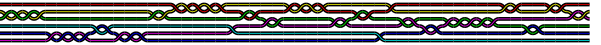
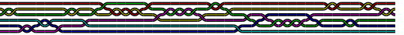

# BraidGroup

[](https://github.com/abraunst/BraidGroup.jl/actions/workflows/ci.yml?query=branch%3Amain)

This small package implements Artin's $B_\infty$ Braid group and some tools.

In particular, it implements 

* Standard group operations, including `*`, `inv`, `^` and `one`
* Artin's free simplification `freesimplify!`
* [Dehornoy](https://www.lmno.cnrs.fr/archives/dehornoy/Papers/Dfo.pdf) reduction `reduced`, allowing to implement Braid equivalence `==`.
* Nice `Braid` visualizations using `Compose`

It is similar in scope to [Braids.jl](https://github.com/jwvictor/Braids.jl) from which it draws some inspiration. At difference with it, this package:

* Represents the $B_\infty$ group rather than $B_n$
* Internally represent braids as product of generators, whereas `Braids` stores powers of generators.
* Implements both `MIME"text/html"` and `MIME"text/plain"` output
* Operations are done in-place as much as possible: in particular, `reduced!` is almost non-allocating, and each H iteration is linear in the length of the braid.
* On the negative side, the interesting matrix representation included in `Braids.jl` is not implemented.


```julia
julia> b = prod(braid(rand(1:5))^rand(-2:2) for i=1:40)
```

displays in `MIME"text/html"` (e.g. in a notebook) as:



and in `MIME"text/plain"` as:

```julia
σ₂⁻²σ₅⁻²σ₄²σ₅⁻¹σ₂⁻²σ₁⁵σ₄σ₂⁻²σ₃⁻⁴σ₂⁻²σ₅σ₁⁻¹σ₃²σ₄²σ₃⁻⁵σ₁⁻²σ₄²σ₁⁻²σ₂⁻²
```

Note that in notebooks you can choose which `MIME` type to display. 
It can be reduced to the unique simplified equivalent braid

```julia
julia> reduced(b)
```




